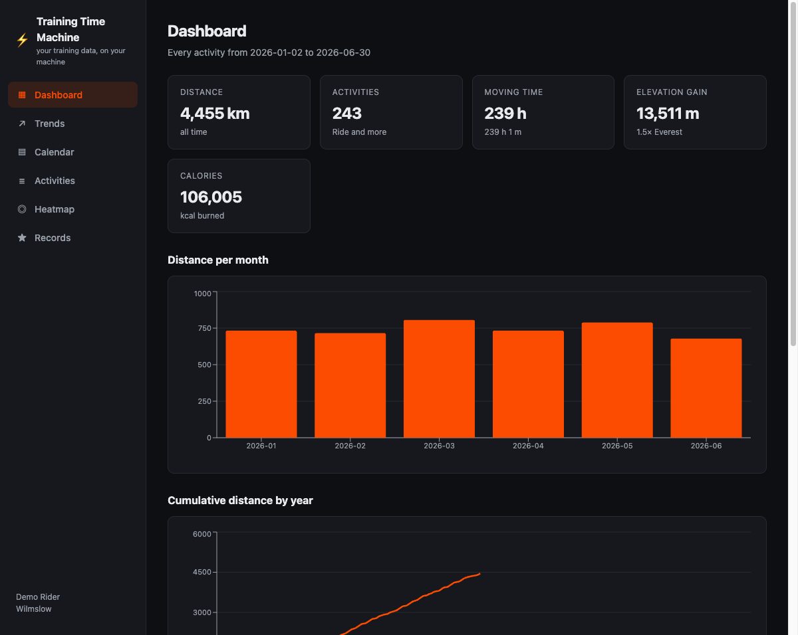
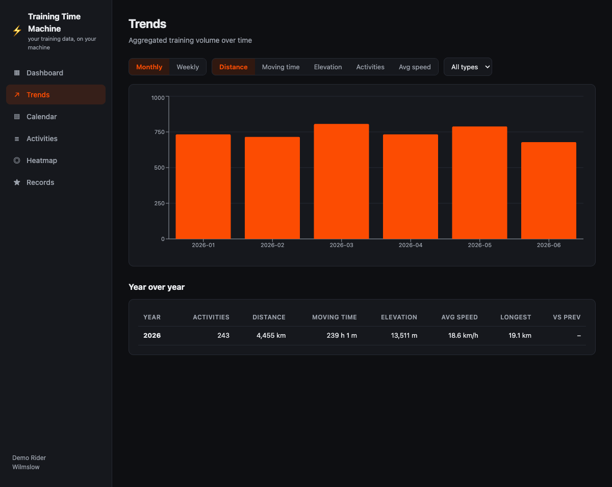
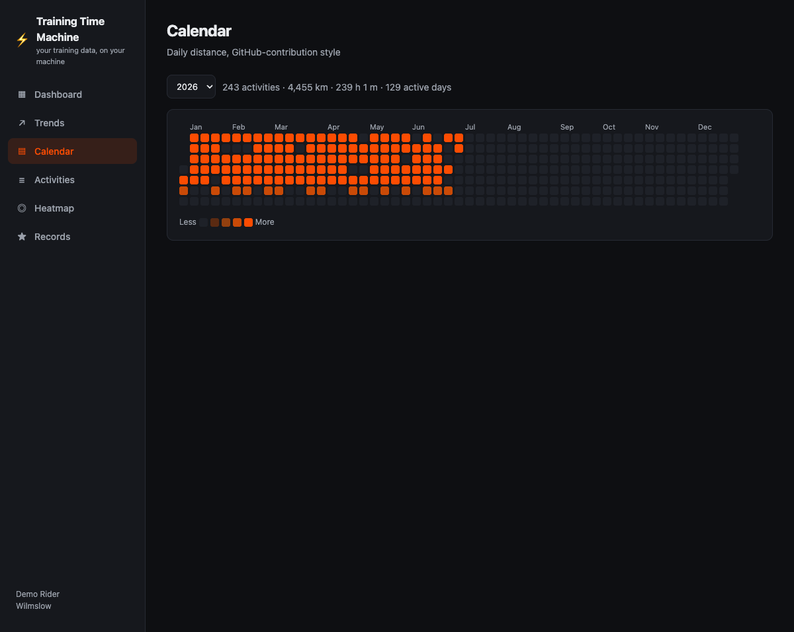
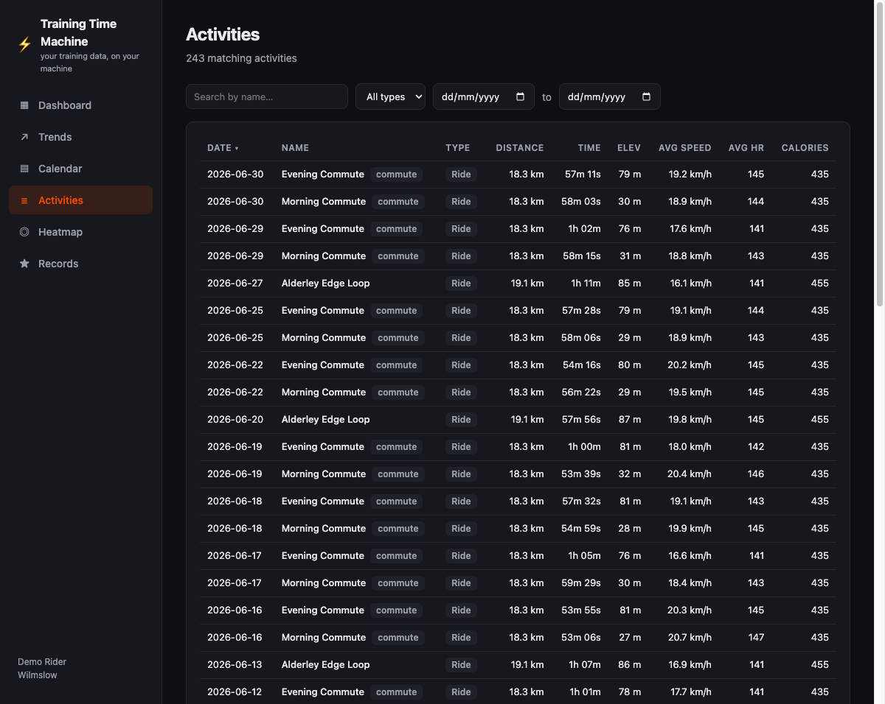
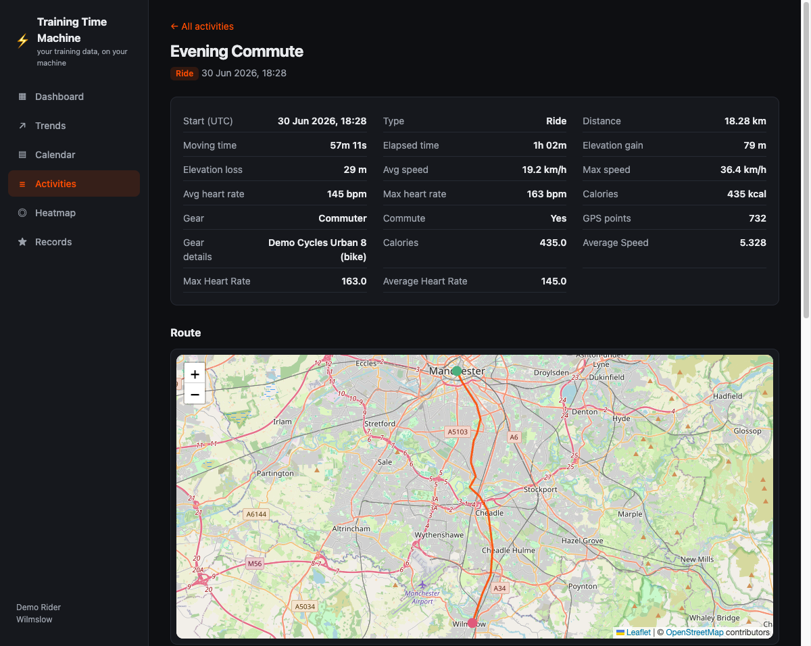
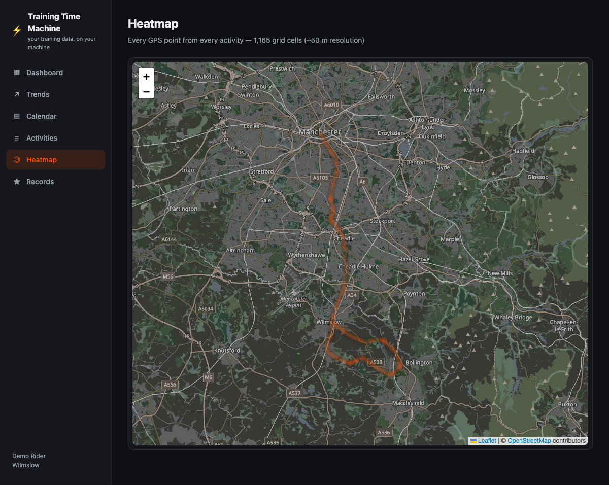
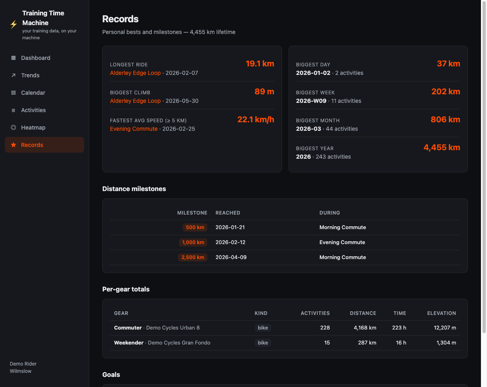

# Training Time Machine — your data, on your machine

**This repo is a protest.** In 2026 Strava put API access to your *own* activities behind a paid subscription: without paying, third-party apps — and you — can no longer read your data through the API (new apps get a `403 Application Inactive` until the developer holds an active subscription). Meanwhile Strava monetises the very same data. Your training history is **your** data; limiting your access to it is wrong.

You don't have to pay to get it back. Data-portability law (GDPR Art. 20, UK GDPR, and equivalents elsewhere) guarantees your right to a copy of your personal data, and Strava honours it through its bulk export. This repo turns that export into something better than the API ever was: a local MySQL database, an MCP server so AI assistants can answer questions about your riding, and a full analysis website — all offline, no Strava account required after the download, no subscription, ever.

## Get your data (free, legal, takes minutes)

1. Go to **<https://www.strava.com/athlete/download_my_account>** (Settings → My Account → Download or Delete Your Account).
2. Under *Download Request*, click **Request Your Archive**. This does **not** delete or affect your account.
3. Strava emails you an `export_XXXXXXX.zip` (usually within a few hours). It contains `activities.csv`, per-activity GPS files, your profile, gear, routes, goals and more.

## What's in this repo

| Module | Folder | What it does |
| --- | --- | --- |
| **Extract** | [`src/extract.ts`](src/extract.ts), [`src/sources/`](src/sources/), [`.claude/skills/strava-extract/`](.claude/skills/strava-extract/SKILL.md) (skill + bundled bash/PowerShell scripts) | Imports an export zip into MySQL: activities, full GPS/HR/power streams, athlete, gear, routes, goals. Providers are [pluggable](docs/architecture.md#pluggable-data-sources); Strava's bulk export is the built-in one |
| **MCP server** | [`src/`](src/) | Lets MCP clients (Claude Code, Claude Desktop, ...) query your history: stats, activities, streams, plus arbitrary read-only SQL |
| **Website** | [`website/`](website/) | "Training Time Machine" — dashboard, trends, calendar heatmap, activity maps, GPS heatmap, records, gear and goal progress. Provider-neutral by design: it never mentions any fitness service |

Everything runs locally. The only network access is OpenStreetMap map tiles in the website.

## Screenshots

All screenshots show **synthetic demo data** — a fictional rider commuting between Wilmslow and central Manchester (generate it yourself, see [Try it without your data](#try-it-without-your-data)). No real person's data appears anywhere in this repo.

| | |
| --- | --- |
| **Dashboard** — headline totals, monthly distance, year comparisons  | **Trends** — weekly/monthly metrics with year-over-year table  |
| **Calendar** — daily distance, GitHub-style  | **Activities** — search, filter, sort every ride  |
| **Activity detail** — full stats, route map, elevation & speed profiles  | **Heatmap** — every GPS point you've ever recorded, on one map  |
| **Records** — bests, milestones, gear totals, goal progress  | |

## Try it without your data

Want to evaluate the tooling before requesting your archive? Generate the fictional commuter dataset shown above and import it:

```sh
npm install && npm run build
docker compose up -d --wait                     # local MySQL
node dist/demo/generate.js /tmp/demo-export     # 243 synthetic rides, Jan–Jun 2026
node dist/extract.js /tmp/demo-export           # import them
website/start.sh                                # browse it (Windows: website\start.ps1)
```

## Quickstart

Prerequisites: [Node.js ≥ 18](https://nodejs.org), [Docker](https://www.docker.com/products/docker-desktop/) (for MySQL), `unzip`.

- **New to the command line?** Follow the step-by-step guides: [Windows](docs/runbooks/easy-windows.md) · [Mac](docs/runbooks/easy-macos.md) · [Linux](docs/runbooks/easy-linux.md)
- **Developer?** Runbooks: [Linux](docs/runbooks/linux.md) · [macOS](docs/runbooks/macos.md) · [Windows](docs/runbooks/windows.md)

```sh
git clone <this-repo> && cd strava-mcp
npm install

# 1. Import your export (starts MySQL via docker compose automatically)
.claude/skills/strava-extract/strava-extract.sh ~/Downloads/export_XXXXXXX.zip
# Windows: .claude/skills/strava-extract/strava-extract.ps1 $HOME\Downloads\export_XXXXXXX.zip

# 2. Explore in the browser (installs/builds on first run, then opens the site)
website/start.sh          # Windows: website\start.ps1
# → http://localhost:5178

# 3. Ask an AI about your riding (Claude Code)
claude mcp add strava -- node /path/to/strava-mcp/dist/index.js
```

## Documentation

- [Architecture & data flow](docs/architecture.md) — how the three modules fit together, database schema
- [Extract module](docs/extract.md) — importer behaviour, schema details, re-import semantics
- [MCP server](docs/mcp-server.md) — tool reference, client registration, configuration
- [Website](website/README.md) — pages, API reference, development
- Developer runbooks: [Linux](docs/runbooks/linux.md) · [macOS](docs/runbooks/macos.md) · [Windows](docs/runbooks/windows.md)
- Beginner guides: [Windows](docs/runbooks/easy-windows.md) · [Mac](docs/runbooks/easy-macos.md) · [Linux](docs/runbooks/easy-linux.md)

## Testing

```sh
npm test              # extract + MCP server (26 tests; integration tests need MySQL up)
cd website && npm test  # website API (24 tests)
```

## Privacy

Your export contains personal data: email address, GPS tracks of every ride (including from your home), messages and more. This repo is built so none of it leaves your machine:

- The database lives in a local Docker volume; MySQL binds to `127.0.0.1` only.
- `data/`, `*.zip` and `.env` are gitignored — your export can never be committed.
- Test fixtures are entirely synthetic.

## License

MIT
